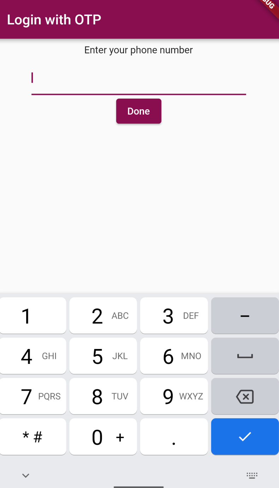
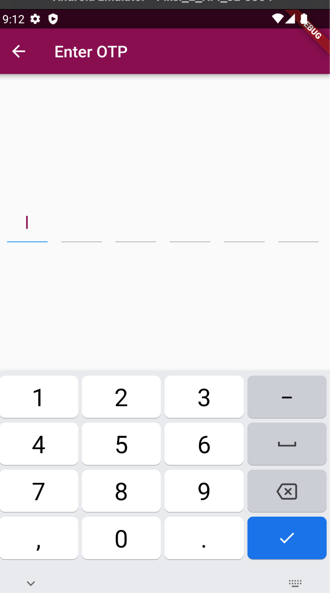
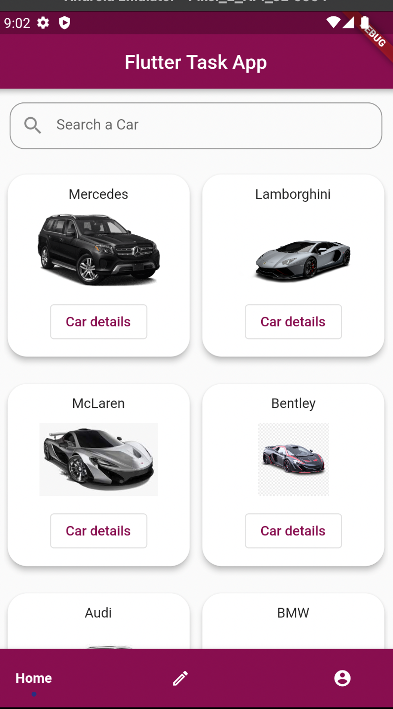
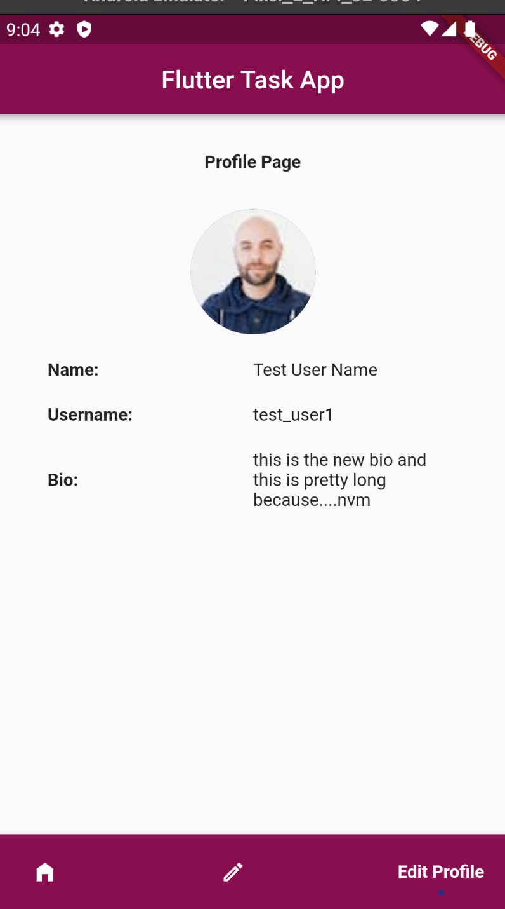
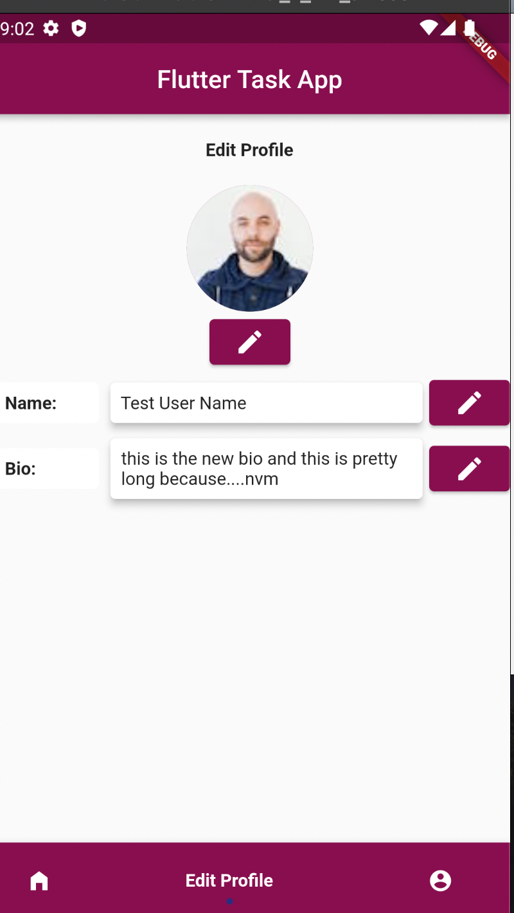

# Flutter Task App

### Screenshots

### A brief overview of the packages used

 - [get](https://pub.dev/packages/get)  
 GetX is the state management tool used in the app.
 Using GetX has many advantages such as it is easy to maintain the state, and also GetX is a dependency manager, navigation manager alongside being a state manager. 
 This advantage of GetX helps flutter development in the long run
 - [flashy_tab_bar](https://pub.dev/packages/flashy_tab_bar)  
 FlashyTabBar is used as a more attractive alternative to BottomNavigationBar
 - [toast](https://pub.dev/packages/toast)  
 Toast is used to show short spanned error/warning messages
 - [otp_text_field](https://pub.dev/packages/otp_text_field)  
 OTP text field is used for OTP handling in the UI

