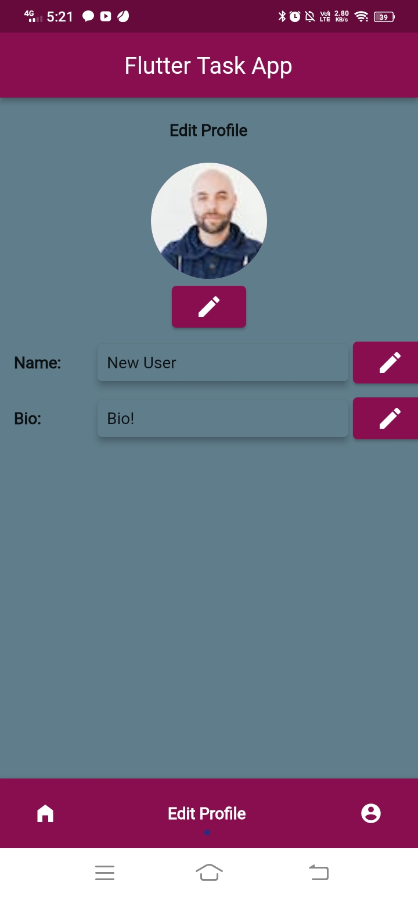

# Flutter Task App

The code for this application follows MVC architecture along with GetX state management tools. 

### A brief overview of the packages used

 - [get](https://pub.dev/packages/get)  
 GetX is the state management tool used in the app.
 Using GetX has many advantages such as it is easy to maintain the state, and also GetX is a dependency manager, navigation manager alongside being a state manager. 
 This advantage of GetX helps flutter development in the long run
 - [flashy_tab_bar](https://pub.dev/packages/flashy_tab_bar)  
 FlashyTabBar is used as a more attractive alternative to BottomNavigationBar
 - [toast](https://pub.dev/packages/toast)  
 Toast is used to show short spanned error/warning messages
 - [otp_text_field](https://pub.dev/packages/otp_text_field)  
 OTP text field is used for OTP handling in the UI
 - [shared_preferences](https://pub.dev/packages/shared_preferences)  
   Shared preferences is a package used to store the user data in local storage of the machine so as to redirect him directly to the home page when he logs in for the second and further times.
 - [glassmorphism_buttons](https://pub.dev/packages/glassmorphism_buttons)  
   Glassmorphism buttons is a button package which consists of frosted-glass styled buttons, this package is built and maintained by me since October 2021.

### Screenshots

